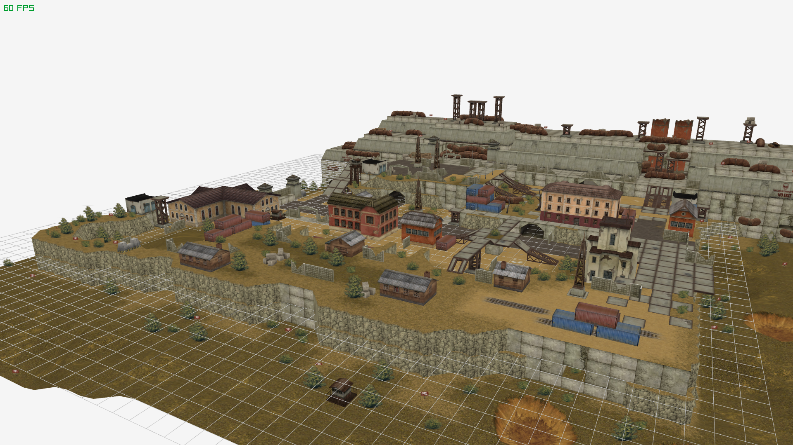

# MapMaster

Tanki Online map editor

## Features
- Performance-oriented modern C++20 implementation of Tanki Online map and
proplib parsing and rendering.

## Goals
- Support all of the features from
[AlternativaEditor](https://en.tankiwiki.com/Map_Editor).
- Support custom proplib creation and editing.
- Being a general-purpose game level creation tool.

## Contributions
- Please write clean and modern code conforming the C++20 standard.
- Whole PRs can be rejected just because of being written by AI. If you use AI,
use it to understand how to implement the thing you're working on and implement
it yourself.
- Be minimalist introducing new libraries. If there's already a library used
in this project supporting the feature you need, use that library. There's no
GUI here yet. For GUI use [raygui](https://github.com/raysan5/raygui).

## Current status
Currently only map and proplib parsing and rendering is implemented in the
MapMaster_Tanki library. I'm working on polishing the implementation. After
finishing it I'll squash the master branch to a single commit. Before
contributing to this library please open a discussion thread and introduce
your ides.
